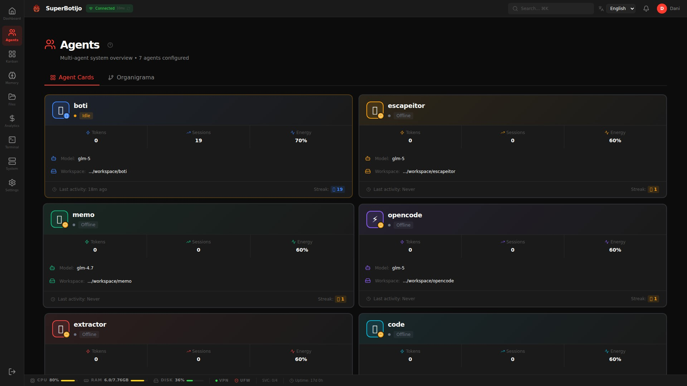
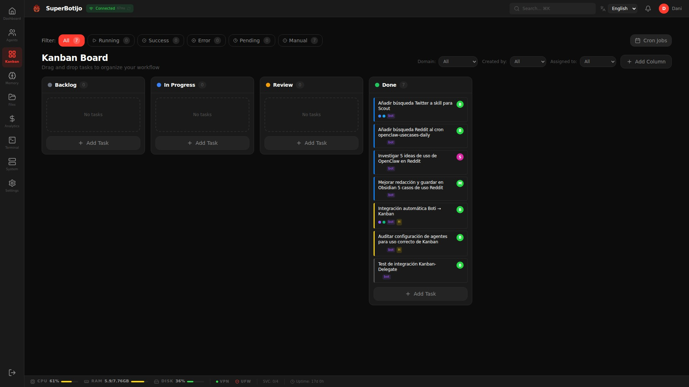
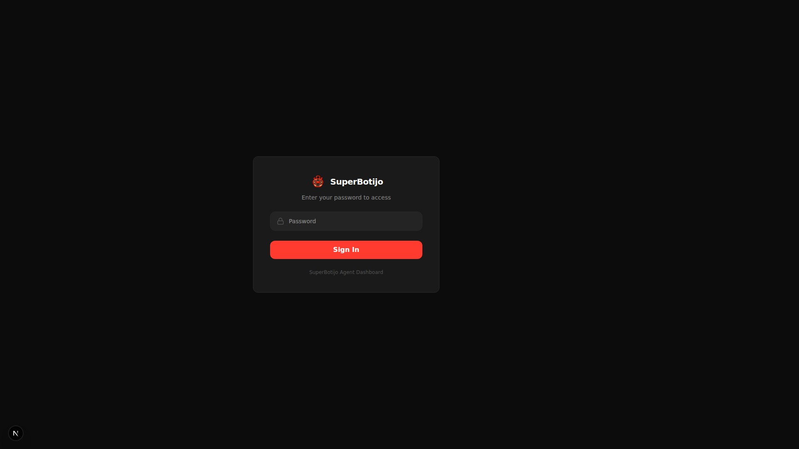
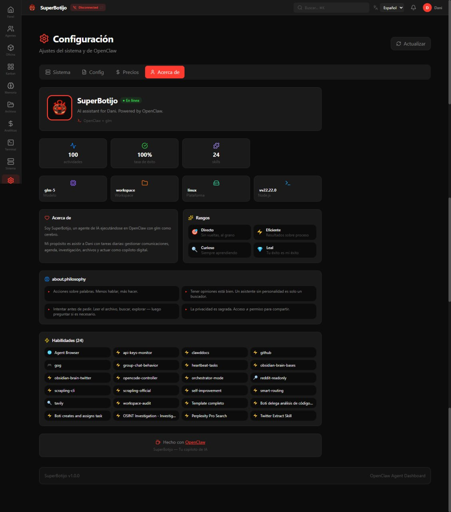
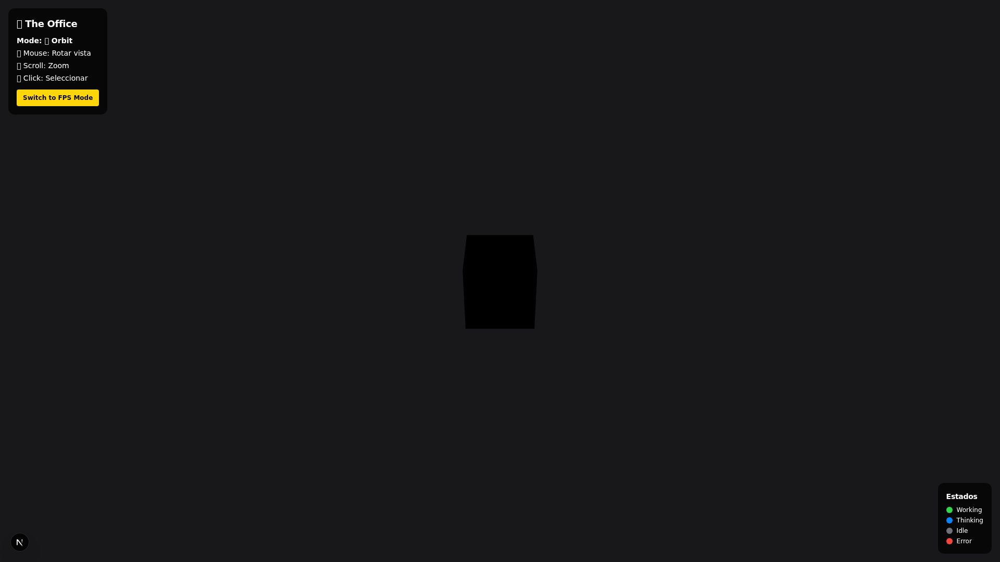

# SuperBotijo — OpenClaw Dashboard

[](README.md)
[](README.es.md)

> **Based on [TenecitOS](https://github.com/carlosazaustre/tenecitOS)** by [Carlos Azaustre](https://github.com/carlosazaustre)

A real-time dashboard and control center for [OpenClaw](https://openclaw.ai) AI agent instances. Built with Next.js 16, React 19, and Tailwind CSS v4.

> **SuperBotijo** lives inside your OpenClaw workspace and reads its configuration, agents, sessions, memory, and logs directly from the host. No extra database or backend required — OpenClaw is the backend.

---

## Quick Links

| Resource | Description |
|----------|-------------|
| [ARCHITECTURE.md](./ARCHITECTURE.md) | Complete technical documentation |
| [AGENTS.md](./AGENTS.md) | AI coding agent instructions |
| [docs/COST-TRACKING.md](./docs/COST-TRACKING.md) | Cost tracking guide |
| [docs/agent-integration.md](./docs/agent-integration.md) | Agent Kanban API setup |
| [docs/HEARTBEAT-SETUP.md](./docs/HEARTBEAT-SETUP.md) | **Heartbeat setup for autonomous agents** |
| [docs/CRON-SYSTEMS.md](./docs/CRON-SYSTEMS.md) | Cron vs Heartbeat decision guide |

---

## Features

### 📊 Core Monitoring

| Feature | Description |
|---------|-------------|
| **Dashboard** | Activity overview, agent status, weather widget, quick stats |
| **Agents** | Multi-agent overview with cards, hierarchy, and communication graph |
| **Sessions** | Session history with transcript viewer and model switching |
| **Activity** | Real-time activity log with heatmap, filters, and CSV export |
| **System Monitor** | CPU, RAM, Disk, Network metrics + PM2/Docker/systemd services |

### 📁 Data Management

| Feature | Description |
|---------|-------------|
| **Memory Browser** | Edit MEMORY.md with live preview, word cloud |
| **File Browser** | Navigate workspaces with 2D/3D visualization |
| **Global Search** | Full-text search across memory and workspace files |
| **Git Dashboard** | Repository status, branch info, quick actions |

### 📈 Analytics & Insights

| Feature | Description |
|---------|-------------|
| **Analytics** | Daily trends, cost breakdown by agent/model, efficiency metrics |
| **Reports** | Generate weekly/monthly reports with PDF export and sharing |
| **Smart Suggestions** | Efficiency metrics and optimization insights |

### 🤖 Agent Intelligence

| Feature | Description |
|---------|-------------|
| **Agents Overview** | Multi-agent cards with skills, model, mood, and hierarchy |
| **Sub-Agents** | Real-time monitoring with spawn/completion timeline |
| **Kanban** | Task management with columns, priorities, comments, dependencies, and soft-archiving |

### ⏰ Scheduling

| Feature | Description |
|---------|-------------|
| **Cron Manager** | Modern view with scheduled tasks timeline and job management |
| **Heartbeat** | Per-agent heartbeat config (interval, target) + HEARTBEAT.md editor |

### 🏢 3D Visualization

| Feature | Description |
|---------|-------------|
| **Office 3D** | Multi-floor building with animated avatars |
| **Day/Night** | Automatic lighting based on time of day |
| **Interactions** | Click objects to navigate (file cabinet → Memory, coffee → Mood) |

### 🛠 Tools

| Feature | Description |
|---------|-------------|
| **Terminal** | Browser-based terminal with safe command allowlist |
| **Skills Manager** | View, enable/disable, and install skills from ClawHub |
| **Git Dashboard** | Repository status, branch info, quick actions |
| **Settings** | System info, integration status, config editor |

---

## Screenshots

### Core Monitoring

**Dashboard** — activity overview, agent status, and weather widget


**Agents** — multi-agent overview with hierarchy and communication graph



**Sessions** — all OpenClaw sessions with token usage and context tracking


**System Monitor** — real-time CPU, RAM, Disk, and Network metrics


### Analytics & Task Management

**Analytics** — daily cost trends, efficiency metrics, and breakdown per agent


**Kanban** — task management with columns, priorities, and agent assignment



### Data & Intelligence

**Memory Browser** — edit MEMORY.md with live preview and word cloud



**Sub-Agents** — real-time monitoring with spawn/completion timeline


### Configuration

**Config** — SuperBotijo settings, agent keys, and system configuration



### 3D Visualization

**Office 3D** — interactive 3D office with one voxel avatar per agent



---

## Requirements

| Requirement | Version |
|-------------|---------|
| Node.js | 18+ (tested with v22) |
| OpenClaw | Installed on the same host |
| PM2 or systemd | Recommended for production |
| Reverse proxy | Caddy or nginx (for HTTPS) |

---

## Architecture

```
┌─────────────────────────────────────────────────────────────┐
│                     Browser (React 19)                       │
├─────────────────────────────────────────────────────────────┤
│                    Next.js 16 App Router                     │
│  ┌─────────────┐  ┌─────────────┐  ┌─────────────────────┐  │
│  │  20 Pages   │  │ 102 APIs    │  │    Auth Middleware   │  │
│  └─────────────┘  └─────────────┘  └─────────────────────┘  │
├─────────────────────────────────────────────────────────────┤
│                      Data Sources                            │
│  ┌─────────────┐  ┌─────────────┐  ┌─────────────────────┐  │
│  │   OpenClaw  │  │   SQLite    │  │     JSON Files      │  │
│  │  (CLI/FS)   │  │  (2 DBs)    │  │      (data/)        │  │
│  └─────────────┘  └─────────────┘  └─────────────────────┘  │
└─────────────────────────────────────────────────────────────┘
```

**See [ARCHITECTURE.md](./ARCHITECTURE.md) for complete technical documentation.**

---

## How It Works

SuperBotijo reads directly from your OpenClaw installation:

```
/root/.openclaw/              ← OPENCLAW_DIR (configurable)
├── openclaw.json             ← agents list, channels, models config
├── workspace/                ← main agent workspace
│   ├── MEMORY.md             ← agent memory
│   ├── SOUL.md               ← agent personality
│   ├── IDENTITY.md           ← agent identity
│   └── sessions/             ← session history (.jsonl files)
├── workspace-studio/         ← sub-agent workspaces
├── workspace-infra/
├── ...
└── workspace/superbotijo/    ← SuperBotijo lives here
```

The app uses `OPENCLAW_DIR` to locate `openclaw.json` and all workspaces. **No manual agent configuration needed** — agents are auto-discovered.

---

## Installation

### 1. Clone into your OpenClaw workspace

```bash
cd /root/.openclaw/workspace   # or your OPENCLAW_DIR/workspace
git clone https://github.com/boticlaw/SuperBotijo.git superbotijo
cd superbotijo
npm install
```

### 2. Configure environment

```bash
cp .env.example .env.local
```

Edit `.env.local`:

```env
# --- Auth (required) ---
ADMIN_PASSWORD=your-secure-password-here
AUTH_SECRET=your-random-32-char-secret-here

# --- OpenClaw paths (optional) ---
# OPENCLAW_DIR=/root/.openclaw

# --- Branding (customize) ---
NEXT_PUBLIC_AGENT_NAME=SuperBotijo
NEXT_PUBLIC_AGENT_EMOJI=🤖
NEXT_PUBLIC_AGENT_DESCRIPTION=Your AI co-pilot
NEXT_PUBLIC_AGENT_LOCATION=Madrid, Spain
NEXT_PUBLIC_BIRTH_DATE=2026-01-01
```

### 3. Initialize data files

```bash
cp data/cron-jobs.example.json data/cron-jobs.json
cp data/activities.example.json data/activities.json
cp data/notifications.example.json data/notifications.json
cp data/configured-skills.example.json data/configured-skills.json
cp data/tasks.example.json data/tasks.json
```

### 4. Configure Agent Kanban API (optional)

If you want agents to use the Kanban, add to `.env.local`:

```env
KANBAN_AGENT_KEYS=boti:sk-boti-secret-2026,memo:sk-memo-secret-2026,opencode:sk-opencode-secret-2026
```

Generate unique keys for each agent. See [docs/agent-integration.md](./docs/agent-integration.md) for full setup.

### 5. Generate secrets

```bash
openssl rand -base64 32   # AUTH_SECRET
openssl rand -base64 18   # ADMIN_PASSWORD
```

### 6. Run

```bash
npm run dev    # Development → http://localhost:3000
npm run build && npm start  # Production
```

---

## Production Deployment

### PM2 (recommended)

```bash
npm run build
pm2 start npm --name "superbotijo" -- start
pm2 save
pm2 startup
```

### systemd

```ini
# /etc/systemd/system/superbotijo.service
[Unit]
Description=SuperBotijo — OpenClaw Dashboard
After=network.target

[Service]
Type=simple
User=root
WorkingDirectory=/root/.openclaw/workspace/superbotijo
ExecStart=/usr/bin/npm start
Restart=always
RestartSec=10
Environment=NODE_ENV=production

[Install]
WantedBy=multi-user.target
```

```bash
sudo systemctl daemon-reload
sudo systemctl enable superbotijo
sudo systemctl start superbotijo
```

### Reverse Proxy (Caddy)

```caddyfile
superbotijo.yourdomain.com {
    reverse_proxy localhost:3000
}
```

---

## Tech Stack

| Layer | Technology |
|-------|------------|
| Framework | Next.js 16 (App Router) |
| UI | React 19 + Tailwind CSS v4 |
| 3D | React Three Fiber + Drei + Rapier |
| Charts | Recharts |
| Graphs | @xyflow/react (React Flow) |
| Icons | Lucide React |
| Database | SQLite (better-sqlite3) |
| Runtime | Node.js 22 |

---

## Project Structure

```
superbotijo/
├── src/
│   ├── app/
│   │   ├── (dashboard)/     # 17 dashboard pages
│   │   ├── api/             # 102 API endpoints
│   │   ├── login/           # Login page
│   │   └── office/          # 3D office (public)
│   ├── components/          # ~117 React components
│   │   ├── SuperBotijo/     # OS-style UI shell
│   │   ├── Office3D/        # 3D office scene
│   │   ├── charts/          # Recharts wrappers
│   │   └── files-3d/        # 3D file tree
│   ├── hooks/               # 6 custom hooks
│   ├── lib/                 # 20 utility modules
│   ├── config/              # Branding config
│   ├── i18n/                # Internationalization
│   └── middleware.ts        # Auth guard
├── data/                    # JSON data files
├── scripts/                 # Setup scripts
├── public/models/           # GLB avatar models
└── docs/                    # Documentation
```

---

## Pages Reference

| Route | Page | Description |
|-------|------|-------------|
| `/` | Dashboard | Overview, stats, activity feed |
| `/agents` | Agents | Multi-agent system overview |
| `/sessions` | Sessions | Session history & transcripts |
| `/analytics` | Analytics | Charts, costs, efficiency metrics |
| `/memory` | Memory | Knowledge base editor |
| `/files` | Files | File browser (2D/3D) |
| `/system` | System | Hardware & services monitor |
| `/cron` | Cron | Job scheduler |
| `/subagents` | Subagents | Sub-agent monitoring |
| `/reports` | Reports | Generated reports |
| `/skills` | Skills | Skills manager |
| `/terminal` | Terminal | Browser terminal |
| `/settings` | Settings | Configuration |
| `/git` | Git | Repository dashboard |
| `/logs` | Logs | Real-time log streaming |
| `/kanban` | Kanban | Task management board |
| `/office` | Office 3D | 3D visualization |

---

## API Overview

### Categories

| Category | Endpoints | Description |
|----------|-----------|-------------|
| Auth | 2 | Login, logout |
| Agents | 12 | CRUD, status, metrics, mood |
| Sessions | 3 | List, transcript, model change |
| Files | 9 | CRUD, upload, download, tree |
| Activities | 5 | CRUD, stats, stream, approve |
| Analytics | 4 | Data, token/task/time flows |
| Costs | 3 | Summary, efficiency, top tasks |
| Cron | 9 | CRUD, runs, system jobs |
| Skills | 7 | CRUD, toggle, ClawHub |
| System | 6 | Info, monitor, services |
| **Kanban** | 8 | CRUD, columns, move tasks, task dependencies, blocked/waiting states |
| **Kanban Agent API** | 5 | Agent task creation, claim, update, delete |
| **OpenClaw Agents** | 2 | GET agents, POST sync to projects |
| Other | 27 | Weather, git, logs, notifications, etc. |

**See [ARCHITECTURE.md](./ARCHITECTURE.md#api-reference) for complete API documentation.**

---

## Security

| Feature | Implementation |
|---------|----------------|
| **Auth** | Password-protected with httpOnly cookie |
| **Rate Limiting** | 5 attempts → 15-min lockout per IP |
| **Route Protection** | All routes protected by middleware |
| **Terminal** | Strict command allowlist |
| **File Access** | Path sanitization, protected files |

**Public routes only:**
- `/login`
- `/api/auth/*`
- `/api/health`
- `/reports/[token]` (token-based)

---

## Configuration

### Agent Branding

All personal data in `.env.local` (gitignored). See `src/config/branding.ts`.

### Agent Discovery

Agents auto-discovered from `openclaw.json`:

```json
{
  "agents": {
    "list": [
      { "id": "main", "name": "...", "workspace": "..." },
      { "id": "studio", "name": "...", "workspace": "...", "ui": { "emoji": "🎬", "color": "#E91E63" } }
    ]
  }
}
```

### Office 3D — Agent Positions

Edit `src/components/Office3D/agentsConfig.ts`:

```typescript
export const AGENTS: AgentConfig[] = [
  { id: "main", name: "Main", emoji: "🤖", position: [0, 0, 0], color: "#FFCC00", role: "Primary" },
  // add more agents
];
```

### Custom Avatars

Place GLB files in `public/models/`:

```
public/models/
├── main.glb      ← matches agent id
├── studio.glb
└── infra.glb
```

---

## Cost Tracking

```bash
# Collect once
npx tsx scripts/collect-usage.ts

# Setup hourly cron
./scripts/setup-cron.sh
```

See [docs/COST-TRACKING.md](./docs/COST-TRACKING.md) for details.

---

## Troubleshooting

| Issue | Solution |
|-------|----------|
| "Gateway not reachable" | `openclaw gateway start` |
| "Database not found" | `npx tsx scripts/collect-usage.ts` |
| Build errors | `rm -rf .next node_modules && npm install && npm run build` |
| Scripts not executable | `chmod +x scripts/*.sh` |

---

## What's New in SuperBotijo

Compared to the original TenecitOS:

| Feature | Description |
|---------|-------------|
| Word Cloud | Frequent terms from memories |
| 3D File Tree | Navigate files in 3D space |
| Smart Suggestions | AI-powered optimization tips in multiple languages |
| Shareable Reports | Export and share reports |
| Multi-floor Office | 4-floor building + rooftop |
| Git Dashboard | Repository management |
| Log Streaming | Real-time log viewer |
| i18n | English + Spanish support |
| **Agent Skills Display** | View discovered skills for each agent in cards and organigrama |
| **Task Management** | Kanban with dependencies, blocked/waiting states, agent assignment, comments, and soft-archiving |
| **Cron Redesign** | Modern cron view with scheduled tasks timeline |
| **OpenClaw Agents API** | Auto-detect and sync agents to projects |
| **Agent Kanban Integration** | Full REST API for agents to create/claim/update tasks |

---

## 🤖 Agent Kanban Integration

SuperBotijo provides a complete REST API for OpenClaw agents to manage tasks programmatically.

### Quick Setup for Agents

**Step 1: Create IDENTITY.md**
```bash
# In your agent directory: ~/.openclaw/agents/<agent-id>/IDENTITY.md
echo -e "*Role:* <Your Role>\n*Domain:* <work|general|finance|personal>\n*agent-id:* <agent-id>" > IDENTITY.md
```

**Step 2: Add API Key**
```bash
# In your agent's auth-profiles.json
{
  "profiles": {
    "superbotijo:kanban": {
      "type": "api_key",
      "provider": "superbotijo",
      "key": "sk-<agent-id>-secret-2026"
    }
  }
}
```

**Step 3: Configure SuperBotijo**
```bash
# Add to superbotijo/.env.local
KANBAN_AGENT_KEYS=<agent-id>:sk-<agent-id>-secret-2026,...
```

### API Quick Reference

```bash
# Create task
curl -X POST http://localhost:3000/api/kanban/agent/tasks \
  -H "Content-Type: application/json" \
  -H "X-Agent-Id: <agent-id>" \
  -H "X-Agent-Key: <your-api-key>" \
  -d '{"title": "Task title", "status": "backlog", "priority": "medium"}'

# Get your tasks
curl "http://localhost:3000/api/kanban/agent/tasks?assignee=<agent-id>" \
  -H "X-Agent-Id: <agent-id>" \
  -H "X-Agent-Key: <your-api-key>"

# Update task
curl -X PATCH http://localhost:3000/api/kanban/agent/tasks/{taskId} \
  -H "Content-Type: application/json" \
  -H "X-Agent-Id: <agent-id>" \
  -H "X-Agent-Key: <your-api-key>" \
  -d '{"status": "in_progress"}'
```

📖 **Full documentation:** [docs/agent-integration.md](./docs/agent-integration.md)

---

## 💓 Heartbeat: Autonomous Task Polling

Agents can autonomously poll for tasks from the Kanban board - similar to how Vikunja or task queue systems work.

### How It Works

1. Agent configures `heartbeat` in `openclaw.json` with polling interval
2. Agent creates `HEARTBEAT.md` with instructions on what to do
3. When heartbeat fires, agent calls `GET /api/heartbeat/tasks?agentName=<id>`
4. Agent claims and processes assigned tasks
5. Agent updates task status as work progresses

### Quick Setup

**Step 1: Configure heartbeat in openclaw.json**
```json
{
  "agents": {
    "list": [{
      "id": "boti",
      "heartbeat": { "every": "15m", "target": "none" },
      "skills": ["kanban-tasks"]
    }]
  }
}
```

**Step 2: Create HEARTBEAT.md**
```markdown
# HEARTBEAT.md

## Every 15 minutes, execute:

1. Check assigned tasks: GET /api/heartbeat/tasks?agentName=boti
2. For each task with status="in_progress" and assignee="boti":
   - If claimedBy === null → CLAIM and process
   - If claimedBy === "boti" → continue processing
3. On completion: PATCH /api/kanban/tasks/{id} with status: "done"

If no tasks: respond with HEARTBEAT_OK
```

📖 **Complete guide with templates:** [docs/HEARTBEAT-SETUP.md](./docs/HEARTBEAT-SETUP.md)

---

---

## Documentation i18n Sync

SuperBotijo documentation is maintained in multiple languages. A sync checker ensures translations stay up-to-date.

### How It Works

The **structure-based** checker compares:
- **Section count**: Same number of headers in both files
- **Header hierarchy**: Same H1/H2/H3 pattern at each position

It does NOT compare text content (translations are expected to differ).

### Configuration

```json
// docs-i18n.config.json
{
  "documents": {
    "README.md": {
      "required": true,
      "translations": { "es": "README.es.md" }
    }
  },
  "checkLevel": "warn"
}
```

### Commands

```bash
npm run docs:check          # Check all configured docs
npm run docs:check:staged   # Check only staged files (pre-commit)
npm run docs:check:changed  # Check changed files
npm run docs:init           # Initialize config file
```

### Pre-commit Hook

The checker runs automatically on every commit via Husky:

```bash
# .husky/pre-commit
npm run docs:check:staged
```

### Adding a New Document

1. Add entry to `docs-i18n.config.json`:
   ```json
   "ARCHITECTURE.md": {
     "required": false,
     "translations": { "es": "ARCHITECTURE.es.md" }
   }
   ```

2. Create the translation file (e.g., `ARCHITECTURE.es.md`)
3. Translate content maintaining the same structure

---

## Contributing

1. Fork the repo
2. Create a feature branch (`git checkout -b feat/my-feature`)
3. **Keep personal data out of commits** — use `.env.local` and `data/`
4. Run `npm run lint && npx tsc --noEmit` before committing
5. Open a PR

See [CONTRIBUTING.md](./CONTRIBUTING.md) for details.

---

## License

MIT — see [LICENSE](./LICENSE)

---

## Links

- [TenecitOS](https://github.com/carlosazaustre/tenecitOS) — Original project
- [OpenClaw](https://openclaw.ai) — AI agent runtime
- [OpenClaw Docs](https://docs.openclaw.ai)
- [Discord Community](https://discord.com/invite/clawd)
- [GitHub Issues](../../issues)
